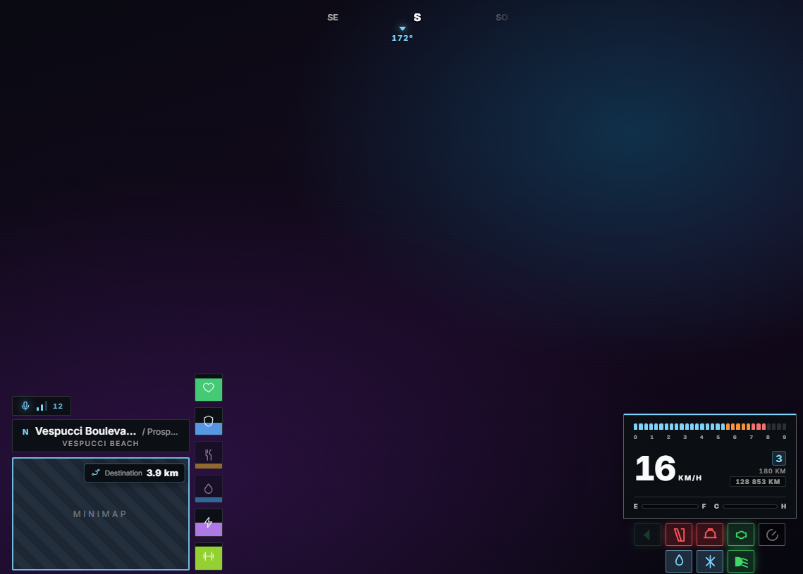
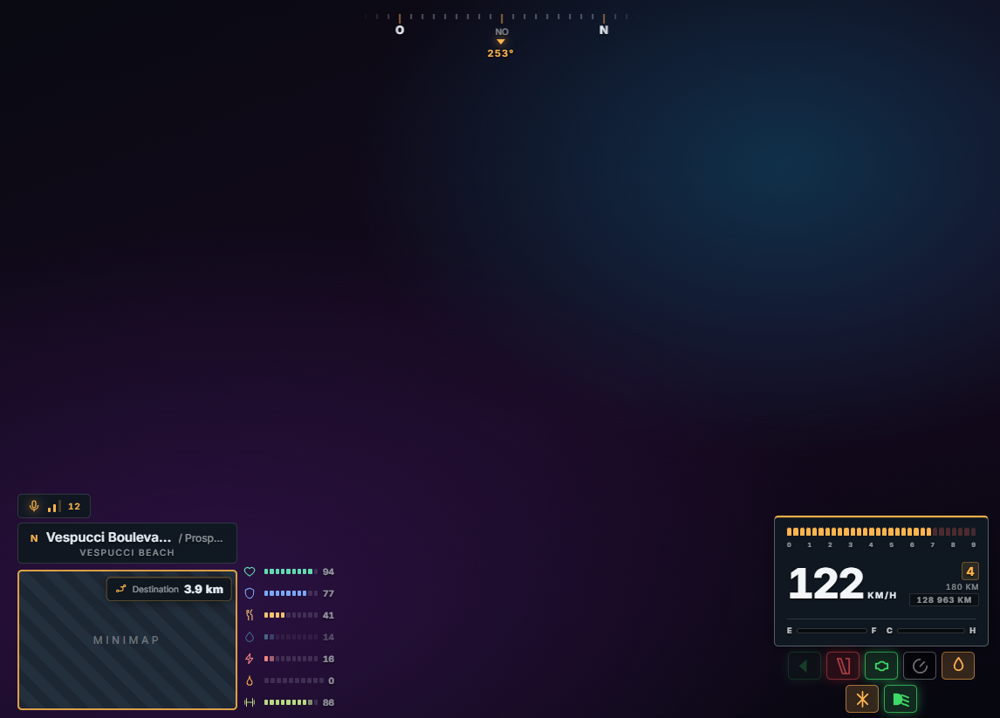

# v-hud

A fully customisable HUD for FiveM, built for QBCore and running on ESX and ox_core too.
Every player owns their own HUD: every element can be moved by dragging it, recoloured,
reshaped, resized or switched off, and the server owner decides which of those freedoms to
leave open. Ships with seven themes, twelve gauge shapes, ten realistic instrument clusters,
four compasses and a frosted-glass default look.

## Features

- **Clear Glass default theme** - translucent panels built from a layered gradient, a lit
  edge and a drop shadow rather than `backdrop-filter`, which FiveM's CEF composites over the
  finished frame and renders as a solid black box. Hot pink accent, Vice City palette. Six
  more ship with it: square minimalist, Miami, neon, modern, Apex and Heritage.
- **Everything is movable** - a drag editor with snap-to-grid, six layout presets, and
  per-element sliders. Positions are a percentage of the screen, so they survive a
  resolution change. Elements anchored near an edge grow away from it, and the HUD clamps
  itself back on screen if a combination would overflow.
- **Twelve gauge shapes** - square, rounded, pill, circle, ring, radial, dot, bar, segment,
  diamond, hexagon, icon-only. One click to switch, per-gauge colours, warning thresholds
  with pulse.
- **Ten realistic speedometers** - modern hybrid dial, classic dial, twin sport dials, digital
  cluster, luxury ring, JDM tachometer, American muscle, supercar, truck cluster, retro LCD.
  Analogue faces use numbered graduations and needles; digital faces use speed or rev scales.
  Fuel remains marked E-F.
- **Sharper instruments** - the minimal face is a freestanding round dial with a digital
  readout inside; the digital face has larger numerals and clearer scales. Apex pairs the digital cluster
  with an amber motorsport palette; Heritage pairs the classic dial with warm enamel tones.
- **Odometer** - the total distance a vehicle has covered, on every cluster. GTA does not
  keep one, so it is measured while you drive and stored against the number plate; a mileage
  published by another resource is used instead when there is one.
- **Built around the minimap** - the street banner is the lid of the map at exactly its
  width, the gauges stack up its right-hand edge, and on a ROUND map they follow the curve
  on an arc. All of it docks to the real map rectangle, so it tracks when the map is moved,
  resized or reshaped, and lands correctly on an ultrawide.
- **Compass and street names** - four compass styles (bar, tape, dial, text), street +
  cross street + district banner. The compass ships off; it is two clicks to turn on.
- **Minimap control** - square or circle, resizable, hideable, vehicle-only mode, and
  draggable in the layout editor like everything else. Moves the real game minimap, so blips
  move with it. Ships the shape masks, so a square border sits on a square map.
- **GPS distance** - a small readout on the minimap shows kilometres along the active game
  route, updates as it changes and disappears when the route or radar is gone.
- **No money on screen** - a cash readout parked in a corner all session is the first thing
  most players switch off, so it is not drawn at all, and neither is the "you gained $50"
  banner. `/cash` and `/bank` answer once, as a toast, and go away.
- **Immersive mode** - the HUD fades out when nothing is happening and returns the moment
  anything moves. Compact mode, cinematic bars, HUD scale and opacity sliders.
- **Player-chosen refresh rate** - 30 / 60 / 90 fps, like qb-core's own setting.
- **Server policy** - lock any setting by dotted path, restrict the theme and speedometer
  lists, bound every slider, force settings per job or gang, push presets with `/hudadmin`.
- **Persistence** - KVP locally plus an optional database copy through oxmysql, so settings
  follow the character between machines.
- **Stress system** - server-authoritative, with the same events qb-hud used, so every
  stock qb resource keeps working unmodified.

## Browser preview

These captures show the standalone preview with a GPS route active. They are not in-game
screenshots.

| Square theme | Apex theme |
|---|---|
|  |  |

## Compatibility

Everything below is detected at runtime and optional. Nothing is required.

| Capability | Detected |
|---|---|
| Framework | qb-core, qbx_core, es_extended (ESX), ox_core — first one detected wins, `Config.Compat.forceFramework` overrides. Anything else runs standalone. |
| Gets out of the way of | the GTA pause menu, any resource holding NUI focus, and anything publishing an "am I open" export — v-phone, qb-phone, lb-phone, qb-inventory, ox_inventory (`Config.HideWhen`) |
| Fuel | rcore_fuel (with range/litres), qb-fuel, LegacyFuel, ps-fuel, cdn-fuel, lc_fuel, x-fuel, okokGasStation, Renewed-Fuel, ox_fuel, native fallback |
| Voice | pma-voice, saltychat, mumble-voip |
| Notifications | qb-core, ox_lib, okokNotify, own themed toasts |
| Inventory (harness) | qb-inventory, ox_inventory, qs/ps/origen/codem/core |
| Mechanic / NOS | jim-mechanic (events + `hasnitro`/`noslevel` state bags), qb-mechanicjob, qb-tunerjob |
| Sounds | interact-sound |
| Storage | oxmysql (optional) |

**What differs by framework.** On ESX there is no gang, so `gang:name` overrides never match,
and the job GRADE stands in for the job type; hunger and thirst come from `esx_status` rather
than from player metadata. On ox_core, groups stand in for jobs and notifications use the
HUD's own toasts, since ox_core ships none. Everything else behaves identically.

Run `/hudinfo` in game to print what was actually detected.

## Installation

1. Drop `v-hud` into your `resources/` folder (any category folder works).
2. Stop `qb-hud` - move it out of `[qb]` or remove its `ensure`. Two HUDs fight over the
   minimap, the menu key and the `/cash` command. v-hud answers every event qb-hud handled,
   so no other resource needs editing.
3. `ensure v-hud` after your framework (if the folder it sits in is already ensured, nothing to add).
4. Optional: `setr hud_locale "fr"` for French. It follows `qb_locale` otherwise.
5. Optional: install [oxmysql](https://github.com/overextended/oxmysql) and settings follow
   the character across machines. Without it, settings stay per machine. The table is
   created on first start; nothing to import.

There is no build step. Lua and JS ship as source.

## Usage

| Command | Effect |
|---|---|
| `I` or `/hud` or `/menu` | Open the settings menu (also closes the layout editor) |
| `/hidehud` | Hide the whole HUD and minimap until typed again (not saved) |
| `/cinematic` | Toggle cinematic bars — hides the HUD with them |
| `/hudreset` | Reset every setting to the server default |
| `/hudunstuck` | Release NUI focus if a cursor is ever left on screen |
| `/hudinfo` | Print detected framework, fuel, voice, inventory |
| `/cash`, `/bank` | Show a balance once, as a toast |
| `/hudadmin theme\|preset\|speedo\|reset\|list` | Admin: force settings on a player or everyone |

## Notifications

On a stock QBCore server, notifications belong to **qb-core**, not the HUD:
`QBCore.Functions.Notify` posts to qb-core's own NUI page. Stopping qb-hud removes no
notification, and installing v-hud restyles none of them. v-hud's own messages use themed
toasts (`Config.Notifications`). If you want *every* `QBCore:Notify` in the HUD's theme, set
`Config.Notifications.mirrorQbCore = true` **and** comment out the `SendNUIMessage` call in
`QBCore.Functions.Notify` (qb-core/client/functions.lua) - otherwise you get two
notifications per event. That edit is yours to make; this resource will not patch another
one silently.

## Documentation

| File | What is in it |
|---|---|
| [CONFIG.md](CONFIG.md) | Server owner's guide. Restricting, forcing, locking, per-job overrides. |
| [THEMES.md](THEMES.md) | Writing a theme, three ways, and what the validator will do to it. |
| [API.md](API.md) | Every export, event and state bag another resource can use. |
| [CHANGELOG.md](CHANGELOG.md) | What changed, English then French. |
| [ERROR_LOG.md](ERROR_LOG.md) | Problems hit, root causes, and the rule that stops each recurring. |
| [RULES.md](RULES.md) | Conventions for anyone working on the resource. |

## For server owners, in one minute

Everything is in `config.lua`, in fourteen commented sections. The shape of it:

```lua
-- Cut a list: the option leaves the menu AND is refused on save.
Config.Policy.themes        = { 'glass', 'square' }
Config.Policy.speedometers  = { 'digital', 'classic' }
Config.Policy.gaugeShapes   = { 'square', 'rounded', 'circle' }
Config.Policy.compassStyles = {}                 -- no compass on this server

-- Force a look.
Config.Policy.forcedTheme   = 'glass'
Config.Policy.forcedStyle   = { surface = 'solid', glow = false }
Config.Policy.forcedColours = { accent = '#ff0044' }

-- Decide element by element: 'player', 'forced', or 'off' (removed entirely).
Config.Policy.elements = { streets = 'forced', stress = 'off' }

-- Anything else, by dotted path.
Config.Policy.locked = { 'units', 'advanced.refresh' }
```

**Two things you cannot take away, enforced in code rather than by convention:** players can
always move their elements, and always choose their minimap shape. A config that tries to lock
either is ignored with a warning in the console. See [CONFIG.md](CONFIG.md).

## Sharing a setup

A player exports their whole HUD as a code, pastes it to somebody, and that person applies it.
The code brings the look and leaves the layout alone — elements stay where each player put
them. An imported code goes through the identical validation as any other save, so one
exported on a server with different rules cannot carry a locked value onto yours.
`Config.Policy.allowSharing = false` removes the panel.

## For developers

Exports (client): `GetSettings`, `SetSettings(patch)`, `OpenMenu`, `CloseMenu`, `IsMenuOpen`,
`Notify(msg, kind, ms)`, `AddStress(n)`, `RemoveStress(n)`, `GetNeeds()`, `GetLocation()`.
Exports (server): `AddStress(src, n)`, `RemoveStress(src, n)`, `SetStress(src, n)`,
`GetStress(src)`, `PushSettings(src, patch, msg)`, `ResetSettings(src)`.

Add a status gauge in `Config.Status` - it appears in the HUD, the element list and the
colour picker with no code change. Add a theme in `Config.ExtraThemes`. Every qb-hud event
(`hud:client:UpdateNeeds`, `UpdateStress`, `UpdateNitrous`, `OnMoneyChange`,
`hud:server:GainStress`, ...) is answered.

## Licence

Apache License 2.0. See [LICENSE](LICENSE) and [NOTICE](NOTICE).

Under section 4(d) of the licence, a derivative work must carry the contents of `NOTICE`. The
HUD names its author in its own settings menu, in the footer and under Advanced > About, and
that is where the notice is expected to stay. You may translate it, restyle it to match your
theme, and add your own credits beside it.

The four files in `stream/` are the community-standard minimap masks as shipped with QBCore's
qb-hud. They are not the author's work and are noted separately in `NOTICE`.

## Credits

Author: vyrriox

---

# v-hud (Version Française)

Un HUD entièrement personnalisable pour FiveM, conçu pour QBCore et fonctionnant aussi sur
ESX et ox_core. Chaque joueur possède son HUD : chaque élément se déplace à la souris, se
recolore, change de forme, de taille, ou se désactive, et le propriétaire du serveur décide
lesquelles de ces libertés laisser ouvertes. Livré avec sept thèmes, douze formes de jauges,
dix compteurs réalistes, quatre boussoles et un thème par défaut en verre dépoli.

**Ce qui diffère selon le framework** : sur ESX il n'y a pas de gang (les surcharges
`gang:nom` ne s'appliquent donc jamais) et le grade de métier prend la place du type ; la faim
et la soif viennent d'`esx_status`. Sur ox_core, les groupes tiennent lieu de métiers et les
notifications passent par les toasts du HUD, faute de système propre. Tapez `/hudinfo` en jeu
pour voir ce qui a été détecté.

## Caractéristiques

- **Thème par défaut Clear Glass** - panneaux translucides composés d'un dégradé en couches,
  d'une arête éclairée et d'une ombre portée plutôt que de `backdrop-filter`, que le CEF de
  FiveM compose par-dessus l'image finie et rend en carré noir opaque. Accent rose vif,
  palette Vice City. Six autres livrés avec : carré minimaliste, Miami, néon, modern, Apex
  et Heritage.
- **Tout est déplaçable** - un éditeur par glisser-déposer avec grille aimantée, six
  dispositions prédéfinies, et des curseurs par élément. Les positions sont un pourcentage
  de l'écran : elles survivent à un changement de résolution. Un élément proche d'un bord
  grandit dans l'autre sens, et le HUD se recadre tout seul si une combinaison déborde.
- **Douze formes de jauges** - carré, arrondi, gélule, cercle, anneau, radial, pastille,
  barre, segments, losange, hexagone, icône seule. Un clic pour changer, couleur par jauge,
  seuils d'alerte avec pulsation.
- **Dix compteurs réalistes** - cadran hybride moderne, cadran classique, double cadran sport,
  cluster numérique, anneau luxe, compte-tours JDM, muscle américaine, supercar, cadrans
  poids lourd, LCD rétro. Les cadrans analogiques ont des graduations chiffrées et des
  aiguilles ; les compteurs numériques ont une échelle de vitesse ou de régime. Le carburant
  reste repéré de E à F.
- **Compteurs plus lisibles** - le modèle minimal est un cadran rond autonome avec une petite
  lecture numérique intégrée ; le compteur numérique a des chiffres agrandis et des échelles plus nettes.
  Apex associe le compteur numérique à une palette de course ambre ;
  Heritage associe le cadran classique à des tons émaillés chauds.
- **Boussole et noms de rue** - quatre styles de boussole (barre, ruban, cadran, texte),
  bandeau rue + rue transversale + quartier qui peut prendre la largeur de la minimap et se
  poser dessus.
- **Contrôle de la minimap** - carrée ou ronde, déplaçable, redimensionnable, masquable,
  mode véhicule uniquement. Déplace la vraie minimap du jeu : les blips suivent.
- **Distance GPS** - une pastille sur la minimap affiche les kilomètres de l'itinéraire actif
  du jeu et disparaît quand le trajet ou le radar est masqué.
- **Mode immersif** - le HUD s'efface quand il ne se passe rien et revient dès que quelque
  chose bouge. Mode compact, bandes cinématiques, curseurs de taille et d'opacité.
- **Fréquence de rafraîchissement au choix** - 30 / 60 / 90 fps, comme le réglage de qb-core.
- **Politique serveur** - verrouiller n'importe quel réglage par chemin, restreindre les
  listes de thèmes et de compteurs, borner chaque curseur, imposer des réglages par métier
  ou gang, pousser des préréglages avec `/hudadmin`.
- **Persistance** - KVP local plus une copie optionnelle en base via oxmysql, pour que les
  réglages suivent le personnage d'une machine à l'autre.
- **Système de stress** - décidé côté serveur, avec les mêmes événements que qb-hud, donc
  toutes les ressources qb d'origine fonctionnent sans modification.

## Prévisualisation navigateur

Ces captures montrent la prévisualisation autonome avec un itinéraire GPS actif. Elles ne
proviennent pas du jeu.

| Thème Square | Thème Apex |
|---|---|
|  |  |

## Installation

1. Déposez `v-hud` dans votre dossier `resources/`.
2. Arrêtez `qb-hud` - deux HUD se battent pour la minimap, la touche du menu et `/cash`.
   v-hud répond à tous les événements que qb-hud gérait : aucune autre ressource à modifier.
3. `ensure v-hud` après `qb-core`.
4. Optionnel : `setr hud_locale "fr"` pour le français. Sinon il suit `qb_locale`.
5. Optionnel : installez [oxmysql](https://github.com/overextended/oxmysql) et les réglages
   suivent le personnage. Sans lui, ils restent par machine. La table se crée toute seule.

Pas d'étape de build. Le Lua et le JS sont livrés en source.

## Pour les propriétaires de serveur

Tout est dans `config.lua`, en quatorze sections commentées.

```lua
-- Retirer une entrée : l'option quitte le menu ET est refusée à la sauvegarde.
Config.Policy.themes        = { 'glass', 'square' }
Config.Policy.speedometers  = { 'digital', 'classic' }
Config.Policy.gaugeShapes   = { 'square', 'rounded', 'circle' }
Config.Policy.compassStyles = {}                 -- pas de boussole sur ce serveur

-- Imposer une apparence.
Config.Policy.forcedTheme   = 'glass'
Config.Policy.forcedStyle   = { surface = 'solid', glow = false }
Config.Policy.forcedColours = { accent = '#ff0044' }

-- Décider élément par élément : 'player', 'forced', ou 'off' (supprimé entièrement).
Config.Policy.elements = { streets = 'forced', stress = 'off' }

-- Le reste, par chemin.
Config.Policy.locked = { 'units', 'advanced.refresh' }
```

**Deux choses que vous ne pouvez pas retirer, garanties dans le code et non par convention :**
les joueurs peuvent toujours déplacer leurs éléments, et toujours choisir la forme de leur
minimap. Une config qui tente de verrouiller l'un ou l'autre est ignorée, avec un
avertissement en console. Voir [CONFIG.md](CONFIG.md).

## Documentation

| Fichier | Contenu |
|---|---|
| [CONFIG.md](CONFIG.md) | Guide du propriétaire de serveur : restreindre, imposer, verrouiller. |
| [THEMES.md](THEMES.md) | Écrire un thème, trois méthodes. |
| [API.md](API.md) | Chaque export, événement et state bag utilisable par une autre ressource. |
| [CHANGELOG.md](CHANGELOG.md) | Ce qui a changé. |
| [ERROR_LOG.md](ERROR_LOG.md) | Problèmes rencontrés, causes, et la règle qui évite la récidive. |

## Partager sa configuration

Un joueur exporte tout son HUD sous forme de code, l'envoie, et l'autre l'applique. Le code
apporte l'apparence et laisse la disposition tranquille. Un code importé passe par exactement
la même validation que n'importe quelle sauvegarde : celui exporté sur un serveur aux règles
différentes ne peut pas amener une valeur verrouillée sur le vôtre.

## Notifications

Sur un serveur QBCore d'origine, les notifications appartiennent à **qb-core**, pas au HUD :
`QBCore.Functions.Notify` écrit dans la page NUI de qb-core. Arrêter qb-hud n'enlève aucune
notification, et installer v-hud n'en restyle aucune. Les messages propres à v-hud passent
par des toasts thémés (`Config.Notifications`). Pour avoir *chaque* `QBCore:Notify` aux
couleurs du HUD : `Config.Notifications.mirrorQbCore = true` **et** commentez le
`SendNUIMessage` dans `QBCore.Functions.Notify` (qb-core/client/functions.lua), sinon chaque
événement donne deux notifications. Cette modification vous appartient ; cette ressource ne
touche pas une autre en silence.

## Licence

Licence Apache 2.0. Voir [LICENSE](LICENSE) et [NOTICE](NOTICE).

Selon l'article 4(d) de la licence, un travail dérivé doit reprendre le contenu de `NOTICE`.
Le HUD nomme son auteur dans son propre menu de réglages, en pied de page et sous Avancé > À
propos, et c'est là que la mention doit rester. Vous pouvez la traduire, l'habiller aux
couleurs de votre thème, et ajouter vos propres crédits à côté.

Les quatre fichiers de `stream/` sont les masques de minimap standards de la communauté,
livrés avec qb-hud de QBCore. Ils ne sont pas l'œuvre de l'auteur et sont mentionnés à part
dans `NOTICE`.

## Credits

Author: vyrriox
